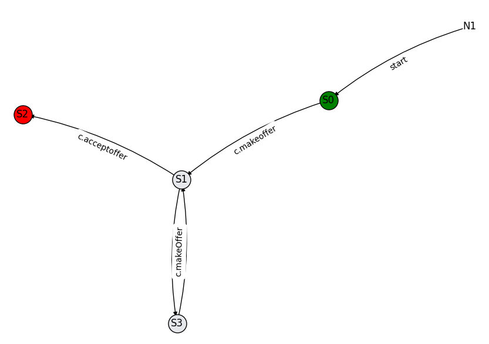

```markdown
# Finite State Machine (FSM) Parser and Visualization

This project contains a Python implementation to parse a description of a Finite State Machine (FSM) and visualize it as a transition graph.

## Prerequisites

- Python 3.x
- NetworkX
- Matplotlib

## Usage

1. Clone the repository:

   ```bash
   git clone https://github.com/your-username/fsm-parser.git
   cd fsm-parser
   ```

2. Example usage in `main.py`:

   ```python
   from fsm_parser import generate_fsm_json
   from fsm_table import generate_fsm_table_json
   from fsm_graph import generate_fsm_graph, draw_fsm_graph

   input_text = "... YOUR FSM DESCRIPTION HERE ..."

   #Generate FSM JSON
   fsm = generate_fsm_json(input_text)

   # Generate FSM transition table as JSON
   table_json = generate_fsm_table_json(input_text)
   print(table_json)

   # Generate and draw FSM transition graph
   graph = generate_fsm_graph(fsm)
   draw_fsm_graph(graph)
   ```

3. Execute the script:

   ```bash
   python main.py
   ```

## FSM Description Format

The FSM description should follow a specific format:

- Each line represents a transition between two states.
- Use `_` prefix for initial states and `+` suffix for final states.
- Use `participant:Type` to represent new participants.
- Use `participant>` to represent existing participants.
- Use `>action` to represent the action called in the transition.

## Example FSM description:

```
N1 c:C>start(c) S0
_S0 b:B>c.makeoffer(p) S1
S1 o>c.acceptoffer() S2+
S1 o>c.rejectoffer() S3
S3 b|b:B>c.makeOffer(p) S1
```


```
For more details, please refer to the [FSM Parser and Visualization documentation](https://github.com/your-username/fsm-parser).
```

## Generated JSON file for that example 

```
{
    "transitions": [
        {
            "from": "N1",
            "to": "S0",
            "initialStates": [],
            "finalStates": [],
            "newParticipants": {
                "c": "C"
            },
            "existingParticipants": {},
            "actionCalled": "start",
            "precondition": "",
            "postcondition": "",
            "externalAction": false
        },
        {
            "from": "S0",
            "to": "S1",
            "initialStates": [
                "S0"
            ],
            "finalStates": [],
            "newParticipants": {
                "b": "B"
            },
            "existingParticipants": {},
            "actionCalled": "c.makeoffer",
            "precondition": "",
            "postcondition": "",
            "externalAction": false
        },
        {
            "from": "S1",
            "to": "S2",
            "initialStates": [],
            "finalStates": [
                "S2"
            ],
            "newParticipants": {},
            "existingParticipants": {
                "o": ""
            },
            "actionCalled": "c.acceptoffer",
            "precondition": "",
            "postcondition": "",
            "externalAction": false
        },
        {
            "from": "S1",
            "to": "S3",
            "initialStates": [],
            "finalStates": [],
            "newParticipants": {},
            "existingParticipants": {
                "o": ""
            },
            "actionCalled": "c.rejectoffer",
            "precondition": "",
            "postcondition": "",
            "externalAction": false
        },
        {
            "from": "S3",
            "to": "S1",
            "initialStates": [],
            "finalStates": [],
            "newParticipants": {
                "b": "B"
            },
            "existingParticipants": {
                "b": ""
            },
            "actionCalled": "c.makeOffer",
            "precondition": "",
            "postcondition": "",
            "externalAction": false
        }
    ],
    "participants": [
        "c",
        "b",
        "o"
    ],
    "types": [
        "B",
        "C"
    ],
    "states": [
        "N1",
        "S2",
        "S0",
        "S1",
        "S3"
    ],
    "initialStates": [
        "S0"
    ],
    "finalStates": [
        "S2"
    ],
    "unreachableStates": [
        "N1"
    ]
}
```